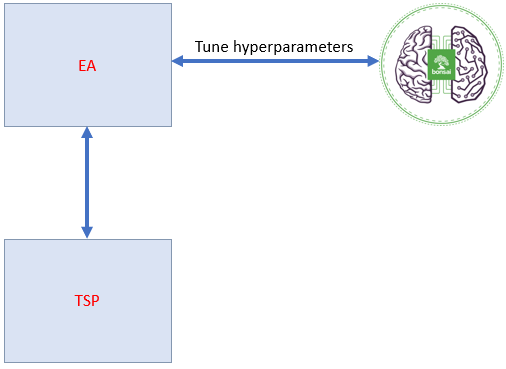

# Travelling Salesman Problem Solved with Bonsai and an Evolutionary Algorithm

This repository shows how to pair deep reinforcement learning (DRL) with
another type of AI algorithm to solve the travelling salesman problem (TSP).
We define the TSP inside a *simulation* and implement a solution to the TSP
in the form of an evolutionary algorithm (EA). We use a DRL agent trained
with [Project
Bonsai](https://www.microsoft.com/en-us/ai/autonomous-systems-project-bonsai)
to tune the hyperparameters of the EA to get the best result for the TSP.



This architecture is a proof-of-concept that could be used to solve any kind
of problem for which a simple DRL approach is not enough. The realm of
applicability is the same as that of the AI algorithm that we use. For this
case we use an EA, therefore the solution work best on problems with a large
state space and many constraints. However, we could as well replace EA with
any other AI algorithm to suit different problems.


## The TSP as a simulation

In a typical Bonsai project we have a simulation that represents the
real world situation that the DRL agent should control. This simulation
accepts in general three type of data structures:

1. Configuration parameters
2. State parameters
3. Action parameters

Therefore we defined the TSP using this paradigm. We used the following
parameters:

1. Configuration: list of cities with 2d coordinates or number of cities
2. State: same as the configuration
3. Action: a path that connects all cities

As an output the TSP provides the length of the path. Minimizing this length
is our task.

If the number of cities is provided as a configuration, the TSP generates
cities at random positions.

We implemented the TSP as a one step problem, meaning that an episode is
completed in one step. At step zero we get the list of cities and their
position, and we reply to the sim with a path. We can run as many episodes as
long as we think we can find a shorter path.

The implementation of the TSP can be found in the file
``sim/travelling_salesman.py``.


## Adding the Evolutionary Algorithm to the simulation

Since many nuances of the TSP are not suitable for DRL we use an EA as
intermediate layer between the Bonsai brain and the TSP. This layer
implements a solution to the TSP. To make it possible for the brain to
interact with the TSP + EA we need to package the EA inside the sim.
This modifies the data structures involved:

1. Configuration: list of cities with 2d coordinates or number of cities
2. State: length of the path provided and the duration in seconds of the
   algorithm run
3. Action: the hyperparameters of the EA

Now the details of the TSP are hidden within the sim. Interacting with it
would just require to provide the values of the hyperparameters and then the
EA will do everything to solve the TSP.

The EA is implemented in ``sim/evolutionary_algo.py``.


## Training the brain

Now that we have a sim with a fixed number of actions we can train a Bonsai
brain in order to find the best hyperparameters for the EA. In order to
quantify what *best* means in this case we define a reward function that is
maximized by the best solution to the TSP. Clearly, having the shortest path
that connects the city is the main objective for the TSP. However, the time
it takes to get the solution is important too. For this reason we define a
reward function that is maximal when

- The path connecting the cities is minimized
- The time it takes to run the EA is minimized

The sim interface for Bonsai is implemented in ``sim/simulator_model.py`` and
``main.py``. The inkling used for brain training is in
``tune-hyperparams.ink``.


## Solution deployment

When we want to deploy the solution we have to deploy both the Bonsai brain
and the EA algorithm. The user API must be receiving as input the parameters
of the object we want to control. In this case the name and location of
cities, but for an industrial control problem these might be sensors
readings. The output variables will be in this case the order in which cities
have to be visited, while for an industrial control problem these could be
setpoints.

The architecture of the deployed solution is therefore composed of two Docker
images. The first one is the exported Bonsai Brain and the second is the EA.
The second image is what a user interacts with to get the solution to the
TSP, and the first image is called just by the EA image in order to get the
best hyperparameters to use with the current TSP configuration.

The EA code that runs in the EA image is implemented in ``app/app.py``. This
is a very simple HTTP API with just one endpoint that the user can poll. The
endpoint accepts a list of cities with their location and returns the best
path as found by the EA + Bonsai Brain.

The solution can be deployed with docker compose and an example configuration
file is provided in ``docker-compose.yml.sample``.

An example call and response from the API is

```bash
$ curl --header "Content-Type: application/json" \
--request POST \
--data '{"london": [0, 0], "paris": [1, 3], "milan": [41, 12], "barcelona": [2, 4]}' \
127.0.0.1:8000/predict

{"best_route": ["barcelona", "milan", "london", "paris"], "best_score": 87.10856842391789}
```
